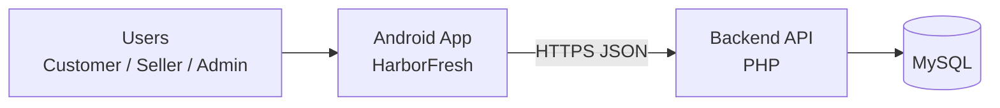
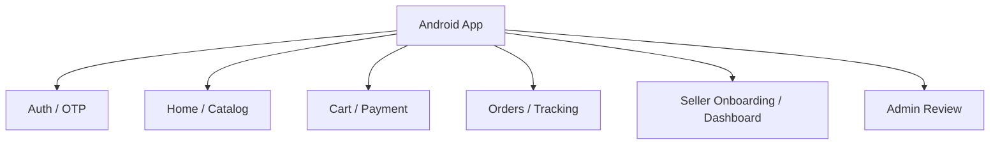
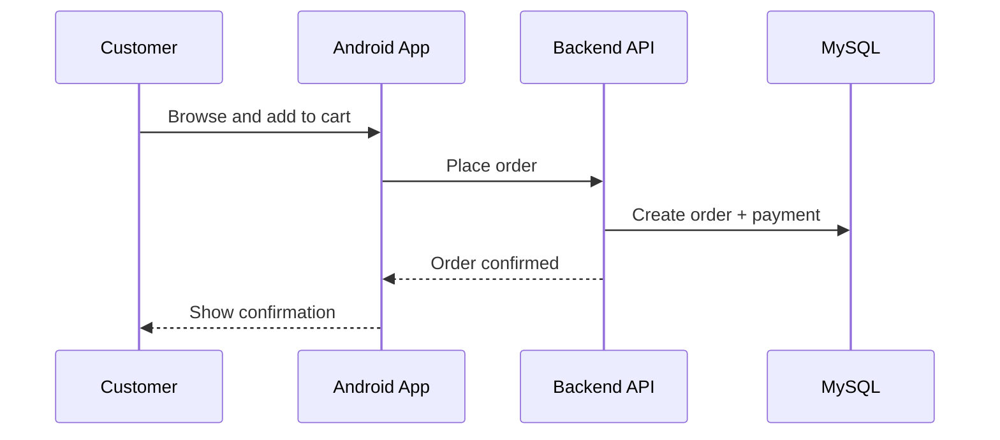
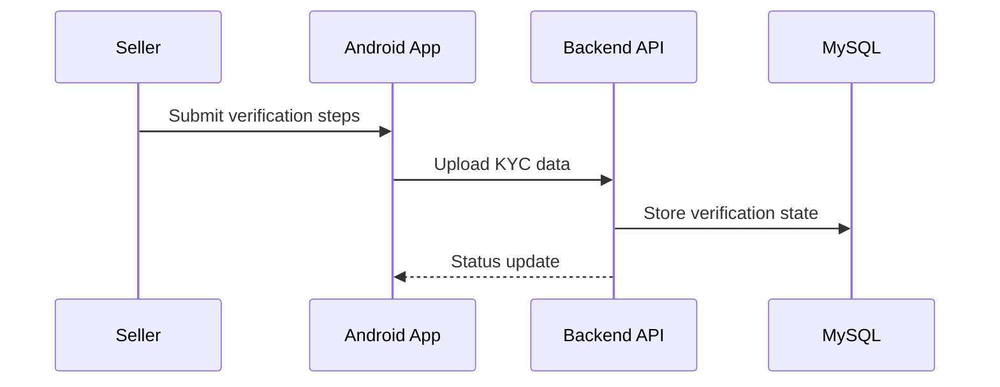

# HarborFresh Android

<div align="center">
  
</div>

<p align="center">
  
  
  
  
  
  
</p>

<p align="center"><strong>HarborFresh</strong> — dock-to-door seafood marketplace Android app for customers, sellers, and admins.</p>

Built by Shashank Preetham Pendyala

---

## Overview

HarborFresh is a production-ready Android client for a multi-role seafood commerce platform. It unifies catalog discovery, ordering, delivery, and post-order tracking for customers, while providing operational and onboarding tools for sellers and admins.

Success is measured by:
- Order conversion rate and checkout completion time
- Seller onboarding completion and verification SLA
- Delivery success rate and order tracking accuracy
- App stability (crash-free sessions) and latency to first contentful view

---

## Table of Contents

- [Demo](#demo)
- [Features](#features)
- [Architecture](#architecture)
- [Layered Architecture](#layered-architecture)
- [Module Inventory](#module-inventory)
- [Tech Stack](#tech-stack)
- [Project Structure](#project-structure)
- [Backend API Map](#backend-api-map)
- [Workflow](#workflow)
- [Workflow Diagrams](#workflow-diagrams)
- [Data Model Summary](#data-model-summary)
- [Environment Variables](#environment-variables)
- [Setup and Run](#setup-and-run)
- [Run, Build, Test](#run-build-test)
- [Configuration](#configuration)
- [Deployment](#deployment)
- [Monitoring and Logging](#monitoring-and-logging)
- [Security Notes](#security-notes)
- [Troubleshooting](#troubleshooting)
- [Roadmap](#roadmap)
- [License](#license)

---

## Demo

<div align="center">
  
  
</div>

---

## Features

### Core

- Role-based experiences for Customer, Seller, Admin
- Home discovery, categories, product detail, search
- Cart, payment, and order confirmation
- Delivery address and slot management
- End-to-end order tracking

### Customer

- Browse catalog, search, favorites
- Place orders and manage deliveries
- Track order status in real time

### Seller

- Seller registration and login
- Multi-step onboarding and KYC verification
- Order intake and fulfillment updates
- Add and manage products

### Admin

- Review and approve seller onboarding
- Seller detail inspection and status updates

---

## Architecture

### System Overview



### Client Modules View



---

## Layered Architecture

### UI Layer

- XML + Material 3 UI
- Consistent typography, color tokens, and shapes
- Role-specific screens and navigation

### Data Layer

- Retrofit API client with JSON parsing
- Session and preference storage
- Local state and adapters for lists

### Domain Layer

- Flow orchestration for onboarding, checkout, and tracking
- Input validation and error handling

---

## Module Inventory

### Activities and Fragments

- Auth, onboarding, identity verification
- Customer home, cart, orders, tracking
- Seller dashboard, orders, profile
- Admin dashboard, seller review

### Networking

- `api/ApiClient.kt`
- `api/ApiService.kt`

---

## Tech Stack

- Android: Kotlin, AndroidX, Material 3
- Networking: Retrofit + Gson
- Images: Glide / Coil
- Payments: Razorpay
- Maps: Google Maps SDK

---

## Project Structure

- `app/src/main/java/com/harborfresh/market/` core app
- `app/src/main/res/` layouts, drawables, themes
- `app/src/androidTest/` instrumentation tests
- `app/src/test/` unit tests

---

## Backend API Map

| Endpoint | Role | Purpose |
| --- | --- | --- |
| `user/*` | Customer | Auth, catalog, orders, tracking |
| `seller/*` | Seller | Onboarding, dashboard, fulfillment |
| `api/admin/*` | Admin | Seller approval and status |

---

## Workflow

### App Flow

1. User opens app and lands on splash/onboarding
2. Auth flow based on role
3. Customer: browse, cart, pay, track
4. Seller: complete verification, manage orders
5. Admin: review sellers and update status

---

## Workflow Diagrams

### Customer Checkout



### Seller Onboarding



---

## Data Model Summary

Core entities:
- Users, roles, sessions
- Products, categories
- Orders, order items, payments
- Addresses, delivery slots
- Seller verification steps and status

---

## Environment Variables

Configured in `local.properties` / build config:
- `MAPS_API_KEY`
- `BASE_URL` (default: `http://<host>/harborfresh_backend/`)

---

## Setup and Run

### Prerequisites

- Android Studio (latest stable)
- JDK 17
- Backend running at `harborfresh_backend`

### Quick Start

1. Open project in Android Studio
2. Update `BASE_URL` in `api/ApiClient.kt`
3. Sync Gradle
4. Run on emulator or device

---

## Run, Build, Test

```bash
./gradlew assembleDebug
./gradlew test
```

---

## Configuration

- Theme tokens in `res/values/colors.xml` and `res/values/themes.xml`
- App name in `res/values/strings.xml`
- Manifest setup in `AndroidManifest.xml`

---

## Deployment

- Generate release builds via Gradle
- Configure signing in `app/build.gradle.kts`
- Distribute via Play Console or internal testing tracks

---

## Monitoring and Logging

- Use Logcat filters for `LoginActivity`, `ApiClient`, `Orders`
- Capture crash and ANR metrics via Play Console

---

## Security Notes

- Do not hardcode API keys in repo
- Use HTTPS in production
- Keep payment keys server-side where possible

---

## Troubleshooting

- If build fails, run `./gradlew clean` and resync
- If API calls fail, confirm backend URL and network permissions
- If maps fail, verify Google Maps key

---

## Roadmap

- Push notifications for order updates
- Offline cart caching
- Seller analytics dashboard

---

## License

MIT License.
See [LICENSE](LICENSE).

